<p align="center">
  <picture>
    <source media="(prefers-color-scheme: dark)" srcset="docs/assets/hero-dark.svg">
    <source media="(prefers-color-scheme: light)" srcset="docs/assets/hero-light.svg">
    
  </picture>
</p>

# Echo

Echo is a private, local dictation app for Windows: press a shortcut, speak, and the Transcript is inserted into whatever app has focus. Speech recognition runs entirely on your machine. Audio and text never leave it; the network is used only to download Models and updates.

<p align="center">
  <a href="docs/assets/echo-reel.mp4">
    
  </a>
</p>

- **Record Shortcut** in Toggle Mode (press to start, press to stop) or Push-to-Talk Mode (hold to record), plus a **Cancel Shortcut** that inserts nothing.
- **Polish and English** are equals, for the UI and for Dictation; pick a Dictation Language or let the Model detect it.
- **Vocabulary** for the names and jargon the Model should favour (GitHub, Tauri, Vulkan…).
- **Models**: Whisper large-v3-turbo (default), Parakeet TDT 0.6B v3 and Whisper small, with resumable, SHA-256 verified downloads. GPU acceleration on any vendor through Vulkan, with a CPU fallback.
- **Overlay** that shows when Echo is getting ready, listening and transcribing, a short **History** of recent Transcripts, a tray icon, opt-in autostart and a signed in-app updater.

## Install

Download the latest installer from [Releases](https://github.com/kowalunioo/echo/releases). Echo runs on Windows only for now.

## Build from source

You need [Bun](https://bun.sh), the Rust toolchain and, for the default Vulkan build, the Vulkan SDK.

```powershell
bun install
bun run tauri dev
```

Run every check before opening a pull request. The Vulkan build breaks on long paths and parallel builds can exhaust the page file, so set a short target directory and limit the jobs:

```powershell
$env:CARGO_TARGET_DIR = "D:\ECHO\.toolchain\target"
$env:CARGO_BUILD_JOBS = "4"
bun run check
```

The hero image above is generated from the real level meter; after changing it, run `bun run readme-hero`.

## Contributing

Read [AGENTS.md](AGENTS.md) first. Scope and architecture are in [docs/plan.md](docs/plan.md), domain terms in [CONTEXT.md](CONTEXT.md), decisions in [docs/adr/](docs/adr/) and behaviour specs in [docs/specs/](docs/specs/).

## License

[MIT](LICENSE). Third-party licences are listed in [THIRD_PARTY_NOTICES.md](THIRD_PARTY_NOTICES.md).
